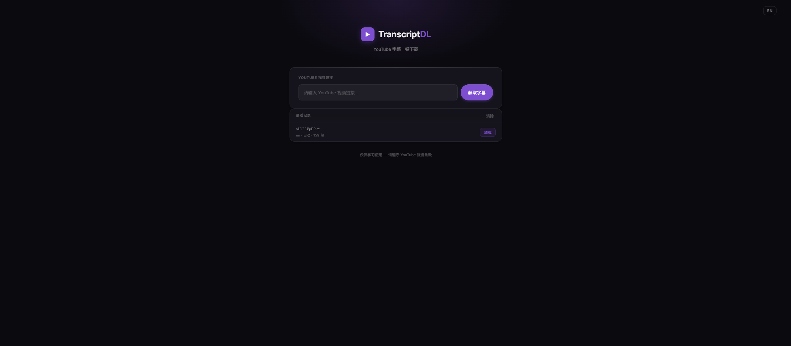
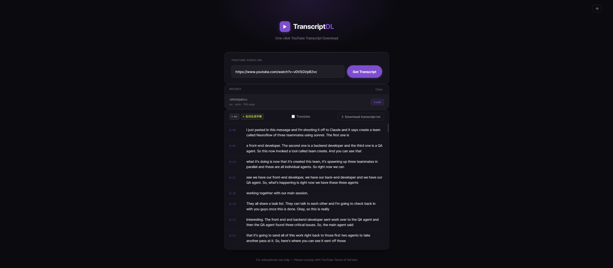
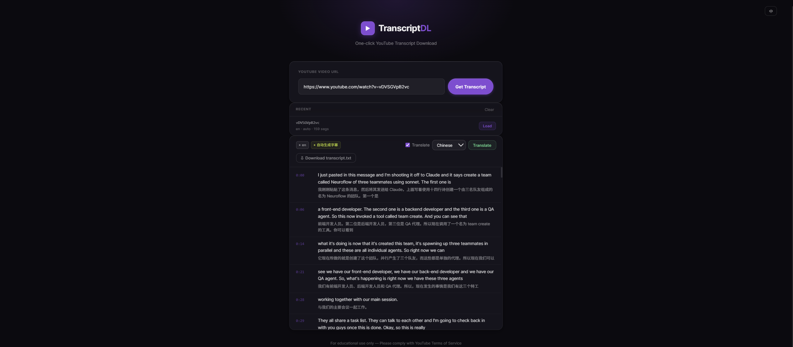

# TranscriptDL

**One-click YouTube Transcript Download**

A clean, minimal web app that fetches, displays, and translates YouTube video transcripts — no account required.



---

## Features

### Fetch Transcripts Instantly
Paste any YouTube video URL and click **Get Transcript**. Supports all major URL formats:
- `https://www.youtube.com/watch?v=...`
- `https://youtu.be/...`
- YouTube Shorts (`/shorts/...`)
- Embed URLs (`/embed/...`)

### Smart Sentence Grouping
Raw caption fragments are automatically merged into readable sentences based on punctuation and natural speech pauses.

### Language Detection
The app prioritizes manually created subtitles, falling back to auto-generated captions. The transcript header shows the detected language and whether captions are auto-generated.



### One-Click Translation
Toggle **Translate**, select a target language (e.g. Chinese), and each segment is translated inline — original text and translation displayed side by side.



### Download as .txt
Download the full transcript (with optional translations) as a plain-text file with timestamps — ready to paste into any LLM or note-taking tool.

### Bilingual UI
Switch between English and Chinese using the language button in the top-right corner.

### Recent History
Previously fetched videos are saved locally and listed under the URL bar for quick reload.

---

## Tech Stack

| Layer | Technology |
|-------|-----------|
| Frontend | Vanilla HTML / CSS / JavaScript |
| Backend | Python · Flask |
| Transcripts | [youtube-transcript-api](https://github.com/jdepoix/youtube-transcript-api) |
| Translation | [deep-translator](https://github.com/nidhaloff/deep-translator) (Google Translate) |

---

## Getting Started

### Prerequisites
- Python 3.8+

### Installation

```bash
# Clone the repo
git clone https://github.com/imdavidlong/youtube-transcript-app.git
cd youtube-transcript-app

# Install dependencies
pip install -r requirements.txt

# Start the server
python backend/app.py
```

Then open `http://localhost:5000` in your browser.

---

## API Endpoints

| Method | Endpoint | Description |
|--------|----------|-------------|
| `GET` | `/api/health` | Health check |
| `POST` | `/api/transcript` | Fetch transcript for a YouTube URL |
| `POST` | `/api/translate` | Translate transcript segments |

---

## Notes

- Transcripts must be available on the video (auto-generated or manual captions).
- Translation uses Google Translate via `deep-translator` — no API key needed.
- For educational use only. Please comply with [YouTube Terms of Service](https://www.youtube.com/t/terms).
